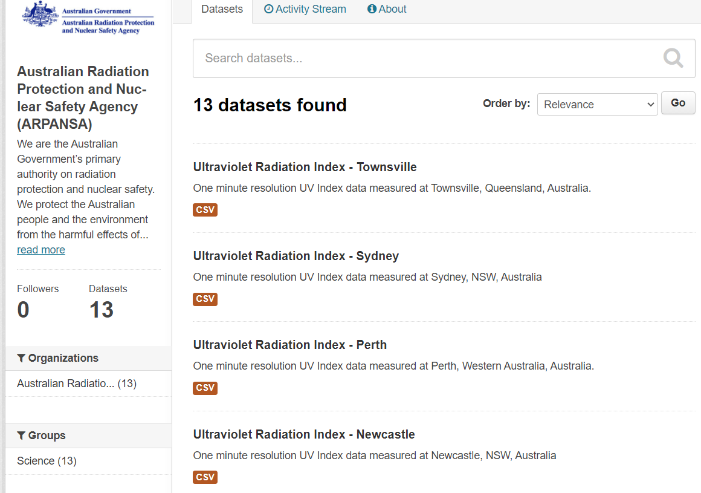
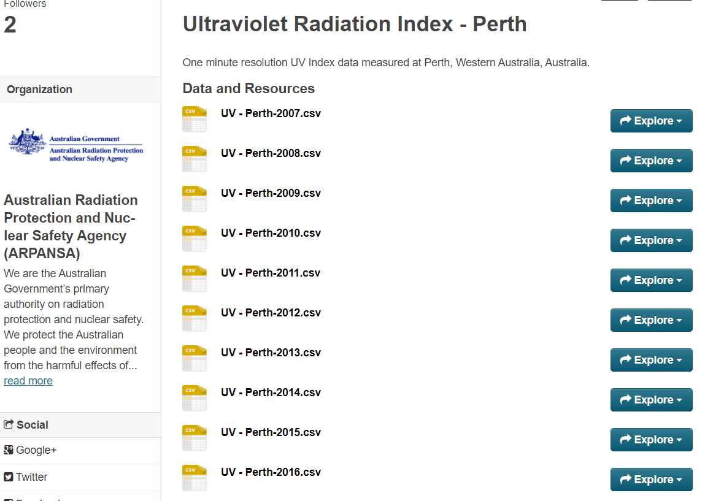
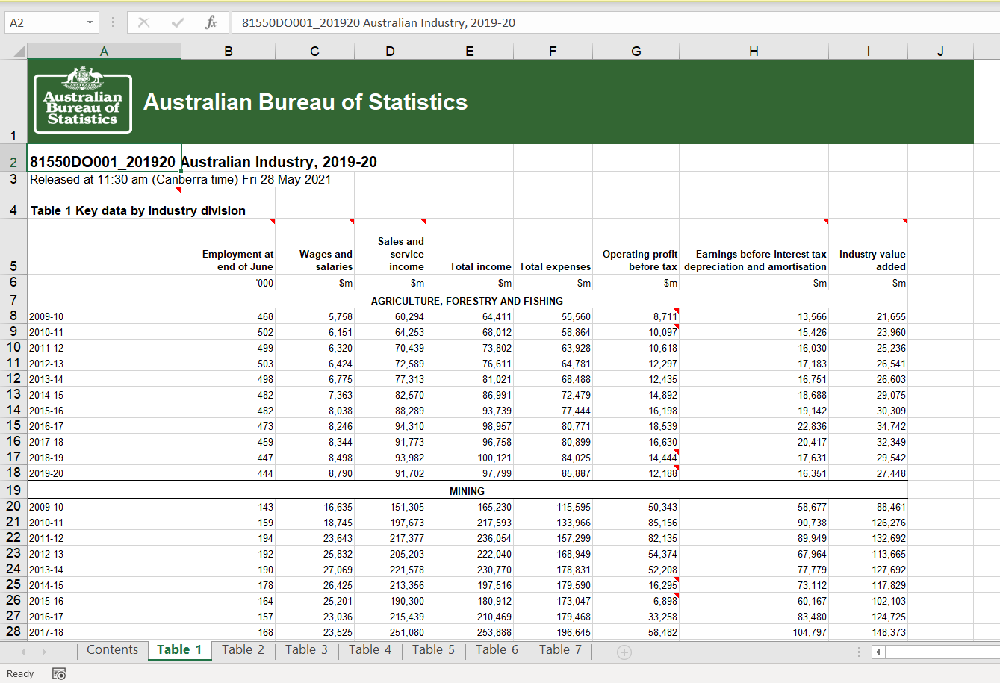
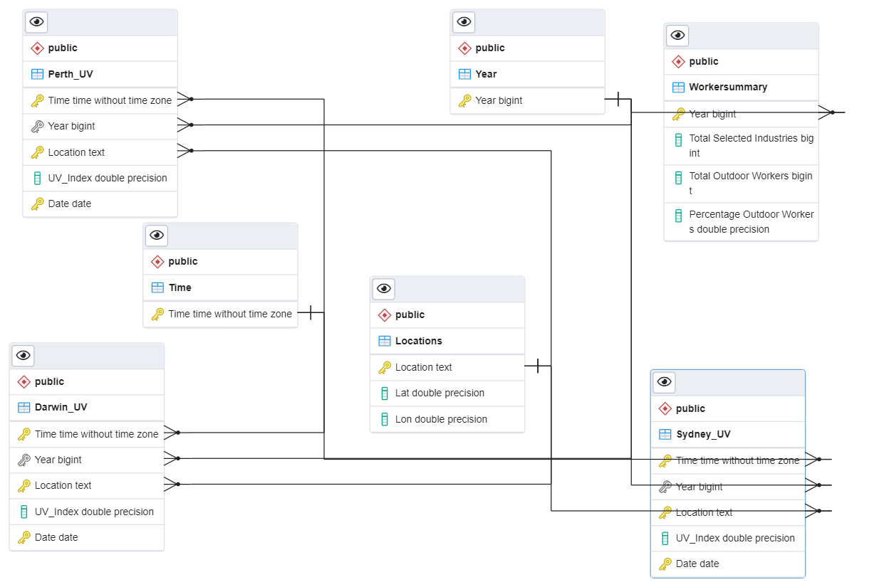

# ETL-Project

# Introduction

The aim of this project was to create a database which could be used to evaluate the risk of skin cancer due to occupational UV exposure. 
The end database allows for modelling to guide targeted preventative measures and also for the creation of visuals that could be used in awareness campaigns. 

The motivation behind this was that although there is recognition of the risk by OSH regulatory bodies and national exposure guidelines exist the broader understanding of the risk is minimal compared to other occupational risks with long term health consequencies like manual handling, asbestos etc. 

Historical UV Index readings from various cities across Australia was obtained from The Australian Radiation Proection and Nuclear Safet Agency (ARPANSA) and that could be related to 
Data from two sources was selected. Historical UV readings from Perth, Darwin and Sydney 

Employment numbers for selected industries were obtained from  

## Extract

Two data sources were used:

* [ARPANSA UV Index data](https://data.gov.au/data/organization/australian-radiation-protection-and-nuclear-safety-agency-arpansa)
* [ABS Employment Numbers for Selected Industries](https://www.abs.gov.au/statistics/industry/industry-overview/australian-industry/2019-20)

The ARPANSA data is minute resolution UV Index readings from various cities, across several days in csv files grouped by year from 2007 to 2019. Each cities data is contained on a separate webpage as shown below:

It was decided to obtain data for Perth, Sydney and Darwin to capture a larger geographical range. This data was scrapped using splinter (0.14.0) and webdriver_manager (3.4.2) due to the number of csv files required. 
The scraping was performed using a function that visited the city specific website, identfied each csv url and returned a list of file urls. Each file in the list was converted to a pandas dataframe and transformed using a function described below.

The ABS data was downloaded as an xls file from the website and saved into the repository. Only the second sheet was required, Table_1. This was imported as a series of pandas dataframes.

## Transform

The format of each city/year UV data was the same, "Date-Time" or "Timestamp" were used interchangably in the date/time column: 

|Date-Time|Lat|Lon|UV_Index|
|-|-|-|-|
|1/01/201 0:00|-31.93|115.98|0.01|

Each dataframe was transformed in a function which added the city name in a "Location" column, converted the "Date-Time" or "Timestamp" column to datetime and abstracted the Year, Time, and Date.
The final dataframe returned contained "Time", "Year", "Location", "UV_Index" and "Date" columns and was appended to a single dataframe for each city. 

The year and time were separated into separate columns as the aim of the end database is to compare UV Index trends for time of day in each city over the years. 
Having the year separated out also made it possible to relate other annual datasets such as the workforce data and potentially in the future cancer and death rate data.

A separate location dataframe was created which contained city names, latitute and longitude which would make relating future additional datasets to the UV data easier.

A time dataframe and year dataframe containing unquie time and year values were created so that each cities table to eachother via these tables and also have the workforce table relate to the year table.

Although the ABS dataset was contained in a single file the format required more extensive transformation.

To decide the percentage of Australian workers with increased UV exposure risk we selected industries that would have higher percentages of outdoor workers such as construction and agriculture which we believed would provide a rough estimate of total outdoor workers.

Only employment numbers from column B were required with the dates. Rows from these columns for each "outdoor" industry were imported into separate dataframes. 
Each employement number column from each dataframe was appended to a single dataframe to sum the total number of outdoor workers across each year.
This total was appended to a dataframe containing the total number of workers overall and a column of percentage outdoor workers per year was calculated.
A calendar year column was also created to make comparing the annual UV data easier.

## Load

All tables were loaded into a postgresql database as per the below schema:

An SQL relational database was chosen due to the strucutured nature of time series data and also the requirement to draw conclusions regarding UV exposure with workforce data via annual trends. It also allows for the structure UV data to be maintained in the future so that consistent values are compared over time.

The SQL format allows for the creation of models and visualisations that could highlight when and where risk of UV exposure is increased and what percentage of the working population could be affected. 
